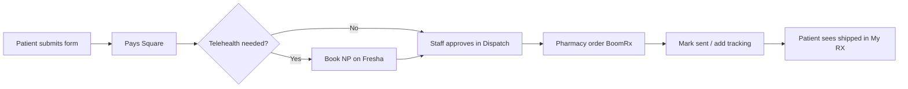

# Hello Gorgeous RX — Owner's Manual

**For:** Ryan Kent, Danielle Alcala, front desk & clinical staff  
**Version:** 1.0 · **Updated:** June 2026  
**Site:** [hellogorgeousmedspa.com](https://www.hellogorgeousmedspa.com)

This is the operating guide for everything we shipped in the **RX-first medical portal**: patient refills, BoomRx pricing, My RX dashboard, admin dispatch, and Square payments.

---

## Table of contents

1. [The big picture](#1-the-big-picture)
2. [Key URLs](#2-key-urls)
3. [Pricing rules (memorize these)](#3-pricing-rules-memorize-these)
4. [Patient journey — end to end](#4-patient-journey--end-to-end)
5. [What patients see](#5-what-patients-see)
6. [Admin daily workflow](#6-admin-daily-workflow)
7. [Admin nav cheat sheet](#7-admin-nav-cheat-sheet)
8. [Square setup & payment sync](#8-square-setup--payment-sync)
9. [Telehealth rules](#9-telehealth-rules)
10. [How to run a test order](#10-how-to-run-a-test-order)
11. [Client texts & talking points](#11-client-texts--talking-points)
12. [What's live vs coming next](#12-whats-live-vs-coming-next)
13. [Troubleshooting](#13-troubleshooting)
14. [Technical reference (for your dev)](#14-technical-reference-for-your-dev)

---

## 1. The big picture

Hello Gorgeous now runs **GLP-1 weight loss** and **peptide therapy** refills like a modern telehealth brand (Hims/Hers style):

| Layer | What it does |
|-------|----------------|
| **Public forms** | Patient submits GLP-1 or peptide refill online |
| **Payment first** | Square checkout at submit — product + separate shipping |
| **Status tracker** | Patient sees intake → telehealth → payment → approval → shipped |
| **My RX portal** | Logged-in patients see all orders, pay links, refill due |
| **Client app (PWA)** | Installable app at `/app` — one tap to My RX |
| **Admin RX hub** | FlowWave, Dispatch, Pharmacy Orders, invoices, ledger |



**Pharmacy:** BoomRx wholesale → you mark up for consumer checkout.  
**Shipping:** Patient pays **$35 cold-chain shipping** as its own line (not baked into product price).

---

## 2. Key URLs

### Patients (share these)

| Purpose | URL |
|---------|-----|
| Install the app | `/get-app` or `/app` |
| Client portal login | `/portal/login` |
| **My RX dashboard** | `/portal/rx` |
| GLP-1 refill form | `/glp1-refill` |
| GLP-1 new intake | `/glp1-intake` |
| Peptide request/refill | `/peptide-request` |
| RX care hub (guides) | `/rx/care` |
| Order status (no login) | `/rx/status` |
| Secure messages | `/rx/messages` |
| Book telehealth | Fresha link from forms & portal |

### Staff (bookmark these)

| Purpose | URL |
|---------|-----|
| Admin home | `/admin` |
| RX Command | `/admin/rx` |
| FlowWave | `/admin/flowwave` |
| Dispatch | `/admin/rx-dispatch` |
| Pharmacy orders | `/admin/rx/pharmacy-orders` |
| RX invoices | `/admin/rx-invoices` |
| RX pricing sheet | `/admin/rx/glp1-pricing` |
| Payment ledger | `/admin/rx-ledger` |
| Patient messages | `/admin/rx-messages` |
| Square connect | `/admin/settings/payments` |
| POS | `/pos` |

---

## 3. Pricing rules (memorize these)

All BoomRx consumer checkout uses the same formula:

| Rule | Value |
|------|-------|
| **Product price** | BoomRx wholesale × **2.5** |
| **90-day supply** | Extra **10% off product only** (not shipping) |
| **Shipping** | **$35** separate line at checkout |
| **Who pays shipping** | **Consumer** (always separate) |

**Example mental math:**  
Wholesale $100 → product $250 (+ $35 ship = $285 checkout).  
90-day wholesale $270 → product $607.50 after 10% off (+ $35 ship).

Staff-facing pricing sheets: **Admin → RX Pricing** (`/admin/rx/glp1-pricing`).

> Do not quote “all-in” prices without mentioning shipping unless you’ve added $35.

---

## 4. Patient journey — end to end

### Step 1 — Intake

Patient completes:
- **GLP-1 refill** (`/glp1-refill`) — existing patients renewing semaglutide/tirzepatide
- **Peptide request** (`/peptide-request`) — new protocol or refill

Form captures medication, dose, supply cycle (30-day vs 90-day), address, clinical flags.

### Step 2 — Payment (automatic)

Checkout creates a **Square payment link** stored in the **RX payment ledger**.  
Policy: **payment first** — we collect before shipping.

Patient can pay from:
- Confirmation email / SMS link
- `/rx/status?ref=…&email=…`
- **My RX** in portal (`/portal/rx`) — **Pay $X** button

### Step 3 — Telehealth (when required)

Rules in [§9 Telehealth](#9-telehealth-rules). If flagged:
- Patient books NP check-in on **Fresha**
- Staff sees flags on dispatch / FlowWave
- **Do not ship** until clinical clearance

### Step 4 — Staff approval & dispatch

1. Open **Dispatch** (`/admin/rx-dispatch`) or **FlowWave**
2. Review intake + payment status
3. Set status: `new` → `reviewed` → `approved` → `sent`
4. Confirm pharmacy (**BoomRx**), ship-to address, drug, sig
5. Place order in BoomRx portal (vendor link in **Admin → Vendors**)

### Step 5 — Pharmacy & ship

1. **Pharmacy Orders** — order sheet / fulfillment tracking
2. When shipped: update dispatch to **sent**, add tracking in staff notes
3. Patient status updates to **Home delivery** complete in My RX

### Step 6 — Refill cadence

For **in-clinic GLP-1 starts** logged as clinic encounters, My RX calculates **refill due** from supply cycle.  
Patient sees “due soon / overdue” banner → taps **Start refill**.

> **Phase 3 (not built yet):** auto-charge every 30/90 days without patient re-submitting.

---

## 5. What patients see

### A. My RX portal (`/portal/rx`) — **the main hub**

Requires portal login (magic link email — no password).

Patients get:
- **Active orders** with step tracker (intake, telehealth, payment, approval, shipped)
- **Pay now** if invoice pending
- **Refill due** banner from clinic history
- Quick links: GLP-1 refill, peptide refill, telehealth, care hub
- **Past orders** (collapsible)

**How they get there:**
- Portal nav → **My RX**
- Portal home → “My prescriptions” card
- Client app → **Me tab** → My prescriptions card
- Client app → Home → **My RX** quick action
- Long-press installed app icon → **My RX** shortcut (PWA)

### B. Client app (`/app`)

Installable PWA — **not** App Store native app. Same website, full-screen on phone.

- **Home:** services, wellness programs, quick actions including My RX
- **Me:** account links, rewards, **My RX card at top**
- RX refill forms also linked from home & RX hub overlay

### C. Public status page (`/rx/status`)

Works **without** portal login if patient has intake ref + email (or secure token from confirmation).

Same step logic as My RX — good for one-off links in SMS.

### D. Portal login

1. Patient enters email at `/portal/login`
2. Receives **magic link** (15 min expiry)
3. Lands on intended page (e.g. `/portal/rx` if they came from the app)

---

## 6. Admin daily workflow

### Opening RX check (5–10 min)

- [ ] **Admin home** — scan RX queue widget
- [ ] **FlowWave** — anything stuck in telehealth or unpaid?
- [ ] **Dispatch** — new intakes since yesterday
- [ ] **RX ledger** — payments marked paid overnight?
- [ ] **Patient messages** — unread secure threads

### When a new refill lands

- [ ] Confirm **payment** in ledger (or nudge patient via invoice)
- [ ] Read **telehealth flags** — contact patient if NP visit needed
- [ ] **Approve** in dispatch when clinically cleared
- [ ] Place **BoomRx order** → update status to sent + tracking

### End of day

- [ ] All paid + approved orders either **sent** or noted why not
- [ ] Square sync if you took in-clinic payments (**Settings → Payments**)

---

## 7. Admin nav cheat sheet

Admin is **RX-first**. Primary sidebar sections:

| Section | Use it for |
|---------|------------|
| **Prescriptions & RX** | Everything pharmacy — FlowWave, dispatch, pricing, ledger |
| **Patients & Schedule** | Clients, calendar, appointments |
| **Payments & Square** | Connect Square, download transactions |
| **Marketing** | SMS, post to social |
| **Forms & Documents** | Consents, aftercare, templates |
| **Vendors** | BoomRx & other vendor portals |
| **Spa operations** *(collapsed)* | Botox charting, memberships, gift cards — still there |

**Mobile admin bottom nav:** Home · RX · Flow · Clients · POS

---

## 8. Square setup & payment sync

**Location:** Admin → Settings → Payments (`/admin/settings/payments`)

### First-time setup

1. Click **Connect Square** (OAuth)
2. Sign in to your Square business account
3. Confirm connection shows merchant + location

### Download historical data

| Button | What it does |
|--------|----------------|
| **Last 7 days** | Quick payment sync |
| **Backfill 90 days** | Import older Square payments into Supabase |
| **Import customers** | Pull Square customers into HG clients |

Run **Backfill 90 days + Import customers** once after connecting.

### Required env vars (Vercel)

- `SQUARE_OAUTH_CLIENT_ID`
- `SQUARE_OAUTH_CLIENT_SECRET`
- `SQUARE_ENVIRONMENT=production`
- `BASE_URL=https://www.hellogorgeousmedspa.com`

---

## 9. Telehealth rules

**Policy:** Payment first. Ship after clinical review when required.

### GLP-1 — telehealth **waived** for this order when:

- Patient chose **90-day prepay**, OR
- Patient set up **3-month monthly auto-pay** at checkout

### GLP-1 — telehealth **required before ship** when:

- **30-day** supply without 3-month auto-pay, AND
- No NP visit within 90 days, OR
- Patient reported **dose changes** or **side effects**

When required: patient books on Fresha; staff contacts them after payment.  
Reorder after a completed cycle: **$35 telehealth check-in** (program consult fee) before next refill.

### Peptides

Follow form flags + NP review. Payment-first same as GLP-1.

---

## 10. How to run a test order

Use this checklist before telling patients the system is ready.

### Test A — GLP-1 refill

1. Submit `/glp1-refill` with a test email you control
2. Complete Square payment
3. Confirm row in **Admin → RX ledger** = paid
4. Open **Dispatch** — verify address, drug, sig prefilled
5. Move status to **approved** → **sent** with fake tracking note
6. Sign into **portal** as that client → **My RX** shows order + steps
7. Open `/app` → Me tab → **My prescriptions** → same dashboard

### Test B — Peptide refill

Same flow via `/peptide-request`.

### Test C — App shortcut

On iPhone: long-press Hello Gorgeous icon → **My RX** → lands on `/portal/rx`.

---

## 11. Client texts & talking points

### Install app + My RX

```
Hi [Name]! Track your GLP-1/peptide refills, pay invoices & reorder from our app:

hellogorgeousmedspa.com/get-app

Tap Me → My prescriptions (or sign in with the email link we send you). 💊
```

### After they submit a refill

```
We got your refill (Ref [REF]). Payment & shipping status are in your My RX dashboard:

hellogorgeousmedspa.com/portal/rx

We'll text/email if telehealth is needed before we ship. Questions? (630) 636-6193
```

### Pricing (phone script)

> “Medication is priced from our pharmacy cost times 2.5. Ninety-day supplies get an extra 10% off the medication. Shipping is $35 cold-chain, separate from the medication — you’ll see both lines at checkout.”

---

## 12. What's live vs coming next

| Feature | Status |
|---------|--------|
| GLP-1 + peptide refill forms | ✅ Live |
| BoomRx pricing (×2.5, 90-day 10% off, $35 ship) | ✅ Live |
| Square checkout + payment ledger | ✅ Live |
| Patient status page | ✅ Live |
| **My RX portal dashboard** | ✅ Live |
| **My RX in client app + PWA shortcut** | ✅ Live |
| Admin RX-first nav + FlowWave | ✅ Live |
| Square OAuth + payment download | ✅ Live |
| Auto subscription / auto-charge every 30–90 days | 🔜 Phase 3 |
| Push notifications for refill due | 🔜 Future |
| Native App Store app | ❌ Not planned — PWA only |

---

## 13. Troubleshooting

### Patient can't see their order in My RX

1. Confirm they signed in with the **same email** on the refill form
2. Check **Admin → Clients** — is `client_id` linked to the submission?
3. Submissions without client link still match by **email** on the form
4. Have them use `/rx/status?ref=…&email=…` as fallback

### Pay button missing

- Ledger may already show **paid** — check **RX ledger**
- Or checkout never completed — resend from **RX Invoices**

### Magic link not arriving

- Check spam; confirm `RESEND_API_KEY` in Vercel
- Use **Admin → Clients** to verify email on file
- Patient can call — staff can trigger login from portal invite flows

### Dispatch empty but form submitted

- Refresh Dispatch; check **RX Command** intake queue
- Verify form template slug is a known RX intake (GLP-1 / peptide)

### Square sync shows zero

- Re-connect at **Settings → Payments**
- Run **Backfill 90 days**
- Confirm `SQUARE_ENVIRONMENT=production` for live account

### App installed but My RX goes to login loop

- Patient must complete magic link in **same browser** (Safari/Chrome)
- After login, should return to `/portal/rx` automatically

---

## 14. Technical reference (for your dev)

| Topic | Location in codebase |
|-------|---------------------|
| Consumer pricing | `lib/boomrx-consumer-pricing.ts` |
| GLP-1 telehealth policy | `lib/glp1-telehealth-policy.ts` |
| Patient status steps | `lib/rx-patient-status.ts` |
| Portal dashboard loader | `lib/rx-portal-dashboard.ts` |
| Portal API | `app/api/portal/rx/route.ts` |
| Portal UI | `components/portal/PortalRxDashboard.tsx` |
| Client app My RX links | `lib/client-app.ts`, `components/client-app/ClientApp.tsx` |
| Admin nav | `lib/admin-nav.ts` |
| PWA manifest shortcuts | `public/client-manifest.json` |
| Dispatch schema | `supabase/migrations/20260624120000_rx_dispatch.sql` |

**Related docs:**
- [Client Portal Guide](./client-portal.md) — general portal features
- [Phase 2 Magic Link](./../PHASE2_CLIENT_MAGIC_LINK.md) — auth design
- [Consumer Login & App](./../CONSUMER_LOGIN_AND_APP.md) — PWA notes

---

*Questions or changes? Tell your dev: “update `docs/manuals/rx-owners-manual.md`.”*

*Hello Gorgeous Med Spa · 74 W. Washington St, Oswego, IL · (630) 636-6193*
